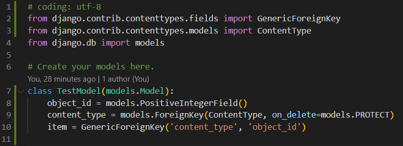

# generic object 会不会自动对 object\_id 和 content\_type 创建联合索引

首先在项目的models.py 里面新建一个model用来验证django 会不会自动给object\_id 和content\_type 创建联合索引

然后，运行`python manage.py makemigrations` 生成migrations 文件，运行`python manage.py migrate` ，完成后，进入MySQL查看效果。

在MySQL 中，使用`use twitter;` 命令将数据库切换成twitter，然后使用`show tables;` 查看所有表。

使用

